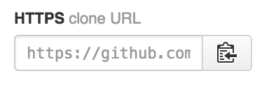

#READ ME

###How to download your notes

1. Click the 'clipboard' icon next to the following in this GitHub repo:

2. Open your terminal.

3. Type `git clone` and paste the URL you copied above.

4. Hit enter.

5. This will download the entire repo to the home folder of your hard drive.

###How to review your notes

I write all of the class notes using HTML (and CSS). This is to help you get familiar looking at code, in addition to learning the content. (Again, the more you see and do, the more you become familiar.)

There are two ways you can review the notes.

1. Open them in your text editor. You will see the text and the code used to mark up the content.

2. Open them in your web browser (File > Open File). This will show you what the notes look like formatted for the web.

I don't expect you to understand what is going on with the code just yet. This is a way for you to see how the code works, and maybe even play with the code. Tinker with it!

###Updating your notes

If you 'watch' this repo in your GitHub account, every time there is a change (i.e. I update the notes), it will show up on your main page feed. When this happens:

1. Open the terminal

2. `cd` to the directory where the notes are stored

3. Type `git pull`. This will download all the updates to your computer! (Pretty cool, eh?)

###FAQ

**What if I play with the code and break it?**

That's okay! Do it! Play! Break! You can always get a fresh copy from our GitHub repo. Simply type:

`git checkout filename`

where filename is the full path of the file you messed up.

So, if you are in `notes` messed up `internet-and-web.html` in the `week-01` directory, you would type:

`git checkout week-01/internet-and-web.html`

**What's this I hear about 'git-ing' extra credit?**

I make mistakes. Code errors. Typos. I make mistakes from time to time. Professors = 100 percent human.

If you find an error in any of the code repos (they have to be .html or .css files), correct it and submit a pull request on GitHub.

Each accepted pull request is worth one point toward your final grade. (In the case of multiple submissions, the first student with the correct fix will earn the point.)

The faster you learn git and GitHub, the sooner you may earn points.

The catch? There are about 50 students taking CVJ 341 this semester, and you share the same notes repo. If you find an error, move fast! (And don't tell anyone else!)
